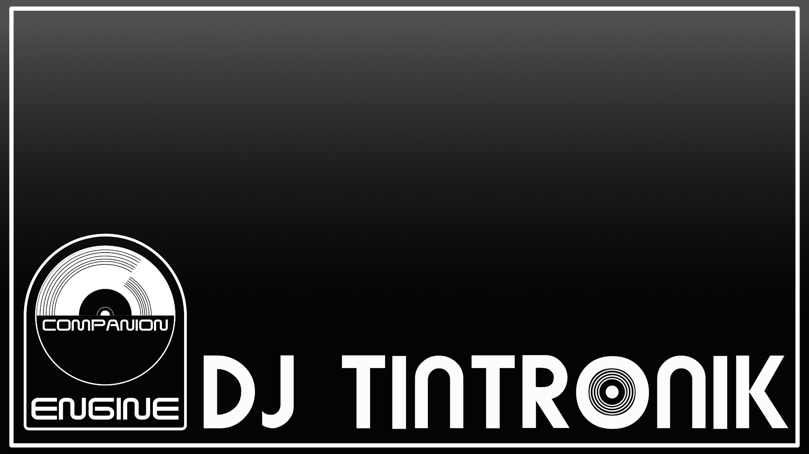

  

  

## Ich bin Tino, Hobby-DJ und Technikfan aus Leipzig  
  

### Schön, dass du da bist!  
Es bereitet mir große Freude, meine eigenen Ideen in Projekten umzusetzen und damit zielgerichtet Probleme zu lösen oder Prozesse zu vereinfachen. Mit Vibe-Coding habe ich endlich das passende Werkzeug, um als Praktiker Ergebnisse in der IT zu erzielen. An aus meiner Sicht gelungenen Lösungen beteilige ich euch gerne.  
  

   

## Languages and Tools  

  
  
  
  
  
  
  

  

   

  

   

  
  

   

 

----

